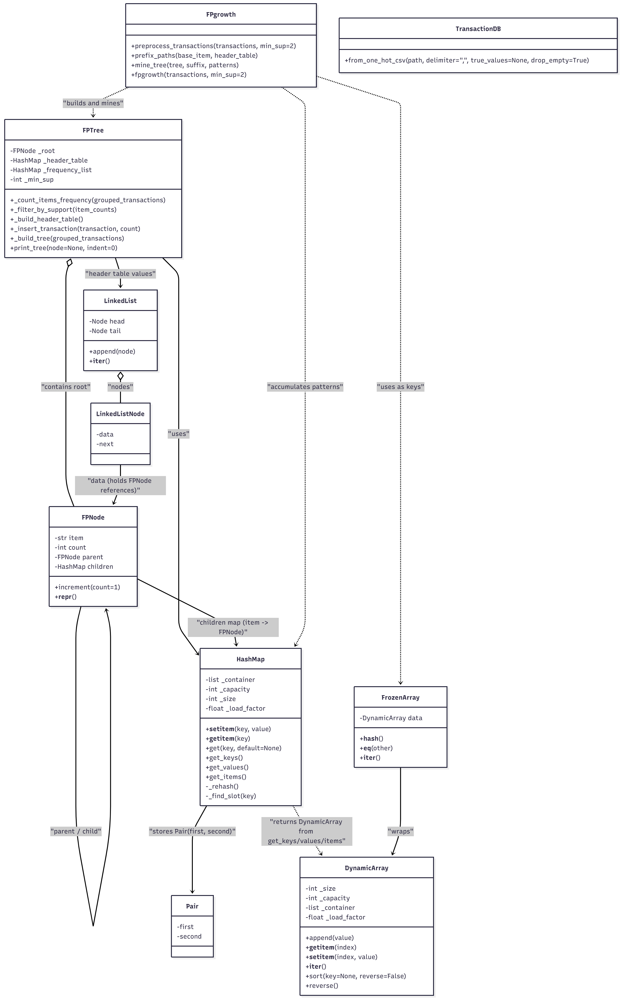

**Quick Start**
- **Run the small example** (bundled sample transactions):
	type this in the command line or the terminal
	- `PYTHONPATH=src python3 test/test.py` 

- **Run the market CSV example** (one-hot encoded CSV provided in
	`assets/market.csv`):
	type this in the command line or the terminal
	- `PYTHONPATH=src python3 test/market_test.py` 

	The `market_test.py` script auto-detects the bundled `assets/market.csv`
	and prints discovered frequent itemsets with their supports. You may
	optionally pass a path and minimum support as arguments:

	type this in the command line or the terminal
	- `PYTHONPATH=src python3 test/market_test.py path/to/your.csv 3`

**Files / Modules**
- `src/FPgrowth.py`: top-level utilities (preprocessing + driver) and
	`fpgrowth()` entry point.
- `src/FPTree.py`: FP-tree and FP-node implementation used by mining.
- `src/HashMap.py`, `src/DynamicArray.py`, `src/LinkedList.py`,
	`src/Pair.py`, `src/FrozenArray.py`: small helper data structures.
- `src/TransactionDB.py`: helper to load one-hot encoded CSV files and
	convert them into a list of transactions.
- `test/test.py`: simple example using in-memory transactions.
- `test/market_test.py`: runner that loads `assets/market.csv` and
	runs FP-growth.

**Architecture**

The following class diagram shows the main classes and relationships
in this implementation. If the image does not display here, place the
diagram file at `assets/class_diagram.png` .



**How to prepare your data**
1. If your transactions are a list of item lists (e.g. `[['a','b'],['b','c']]`), pass
	 that list into `preprocess_transactions(transactions, min_sup)`.
2. If your data is a one-hot encoded CSV (columns are item names,
	 rows contain `1/0` or `true/false`), use `TransactionDB.from_one_hot_csv()`
	 to load it. Example:

```python
from TransactionDB import TransactionDB
from FPgrowth import preprocess_transactions, fpgrowth

transactions = TransactionDB.from_one_hot_csv('path/to/onehot.csv', delimiter=';')
grouped = preprocess_transactions(transactions, min_sup=2)
fpgrowth(grouped, min_sup=2)
```

`TransactionDB.from_one_hot_csv(path, delimiter=',', true_values=None, drop_empty=True)`
- `path` — path to CSV file
- `delimiter` — CSV delimiter (default `,`). For `assets/market.csv` use `';'`.
- `true_values` — optional iterable of strings treated as truthy
- `drop_empty` — if True, skip rows with no truthy values


- Use the library programmatically (minimal example):

	```python
	from TransactionDB import TransactionDB
	import FPgrowth as fp

	txns = TransactionDB.from_one_hot_csv('assets/market.csv', delimiter=';')
	grouped = fp.preprocess_transactions(txns, min_sup=3)
	fp.fpgrowth(grouped, min_sup=3)
	```
**For more in Depth explination seek the main.pdf file in the (/docs) folder**
